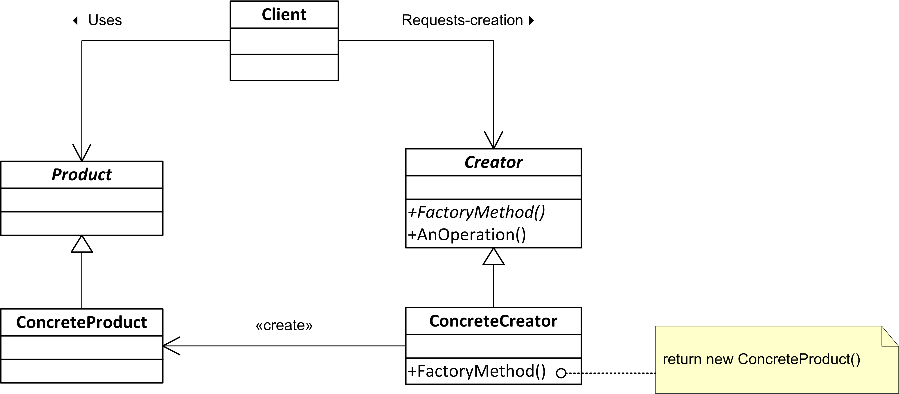
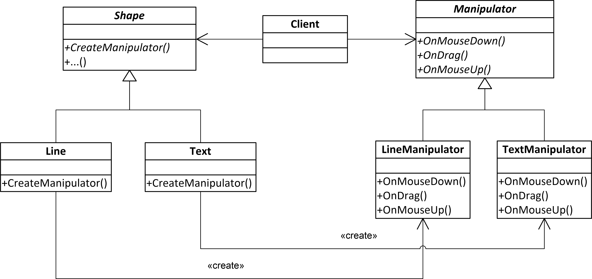

# Factory Method

## Intent

**Factory Method** is a creational design pattern that provides an interface for creating objects and allows its implementors to alter the type of objects that will be created.

## Example - from problem to solution

The class is strongly coupled to the concrete classes it creates. This makes it hard to change the class's behavior or replace the concrete classes with other classes.

```c++
class MusicApp
{
public:
    //...

    void play(const std::string& track_title)
    {
        // creation of the object
        SpotifyService music_service("spotify_user", "rjdaslf276%2", 45);
        
        // usage of the object
        std::optional<Track> track = music_service.get_track(track_title);
        if (track.has_value())
        {
            music_service.play(track);
        }
        else
        {
            //... handle error
        }
    }
    
    //...rest of the class
};
```

The **Factory Method** pattern suggests defining an interface for creating objects, but lets subclasses decide which class to instantiate. This way, the class delegates the object creation to its subclasses.

We can start with extracting an interface for the music service:

```c++
class MusicService
{
public:
    virtual std::optional<Track> get_track(const std::string& title) = 0;   
    virtual void play(Track track) = 0;
    virtual ~MusicService() = default;
};
```

Any specific music service should implement this interface. For example, the `SpotifyService` or `AppleMusicService`.

```c++
class SpotifyService : public MusicService
{
public:
    SpotifyService(const std::string& user, const std::string& password, int port);
    std::optional<Track> get_track(const std::string& title) override;
    void play(Track track) override;
};
```

Then we can abstract the process of creating the music service instance:

```c++
class MusicServiceCreator
{
public:
    virtual std::unique_ptr<MusicService> create_music_service() = 0;
    virtual ~MusicServiceCreator() = default;
};
```

The `MusicApp` class can now delegate the responsibility of creating the music service to the objects implementing the `MusicServiceCreator` interface. The creator can be injected as dependency to the `MusicApp` class.

```c++
class MusicApp
{
    std::shared_ptr<MusicServiceCreator> music_service_creator_;
public:
    MusicApp(std::shared_ptr<MusicServiceCreator> music_service_creator) // DI - Dependency Injection
        : music_service_creator_(music_service_creator)
    {
    }

    void play(const std::string& track_title)
    {
        // creation of the object
        std::unique_ptr<MusicService> music_service = 
            music_service_creator_->create_music_service();

        // usage of the object
        std::optional<Track> track = music_service->get_track(track_title);

        //...
    }
};
```

Now the process of creating the music service is encapsulated in the `MusicServiceCreator` object. The `MusicApp` class is no longer responsible for creating the music service object.
Moreover, the `MusicApp` class is no longer coupled to the concrete class of the music service. It can work with any class that implements the `MusicServiceCreator` interface. The process of instantiating the music service is separated from the usage of the music service.

## Factory Method - Context

We want to introduce a new functionality by writing a new class and creating an instance of that class.

## Factory Method - Problem

* We want to instantiate concrete classes through an abstract interface
* A given class cannot anticipate the type of object to be created
* Information about the type of object to be created is available only at runtime
* Object creation should be separated from the object usage

## Factory Method - Structure



## Factory Method - Collaboration

* The `Creator` class object delegates to its derived classes the responsibility of defining the factory method to create an instance of the appropriate `ConcreteProduct` class (a subclass of the abstract `Product` class)

## Factory Method - Consequences

* Eliminates the need to insert specific classes into the application code.
* Creating objects within a class using a factory method is more flexible than creating them directly.
* Promotes loose coupling by reducing dependencies to concrete classes specific classes in your code.

## Parallel Class Hierarchies

* Parallel class hierarchies arise when a class delegates some of its responsibilities to a separate class



* The Factory Method pattern allows combining parallel class hierarchies

``` c++
std::shared_ptr<Shape> selected_shape = get_clicked_shape();

std::shared_ptr<Manipulator> manipulator = selected_shape->create_manipulator();

manipulator->on_drag(100, 200);
```

### Factory Method - Implementation

* We can implement the factory class as:
    - An abstract class (interface) that does not provide implementations for the methods it declares
    - A concrete class that provides a default implementation of the factory method, but can be overridden by derived classes
* In a simple case, the factory interface can be replaced with a type

```c++ code-noblend fragment
using MusicServiceCreator = std::function<std::unique_ptr<MusicService>()>;
```

### Parameterized Factories

Parameterized factories are used when the type of object to be created depends on the identifier passed to the factory method. As a result, a single factory instance can create objects of different types.
Identifiers can be of different types, such as `std::string`, `enum`, or any other type that can be used to determine the type of object to be created.
The information what type of object to create arrives very often at runtime (when parsing configuration files, user input, etc.).

Such a factory can be implemented as follows:

``` c++
using MusicServiceCreator = std::function<std::unique_ptr<MusicService>()>;

class MusicServiceFactory
{
    std::unordered_map<std::string, MusicServiceCreator> creators_;
public:
    std::unique_ptr<MusicService> create(const std::string& id) const
    {
        auto& creator = creators_.at(id);
        return creator();
    }

    bool register_creator(const std::string& id, const MusicServiceCreator& creator)
    {
        return creators_.emplace(id, creator).second;
    }
};
```

The creators are registered with the factory using the `register_creator` method. As a creator, we can use a lambda function that creates an instance of the desired class.

``` c++
MusicServiceFactory music_service_factory;

music_service_factory.register_creator("Tidal", 
    [] { return std::make_unique<TidalService>("tidal_user", "KJH8324d&df"); });

//...

std::string id_from_config = "Tidal";
MusicApp app(music_service_factory.create(id_from_config));
```

### Factory Method - Related Patterns

* Iterator
* Abstract Factory
    – an abstract factory is often implemented using factory methods
* Template Method
    – factory methods are often called within an algorithm implemented as template method