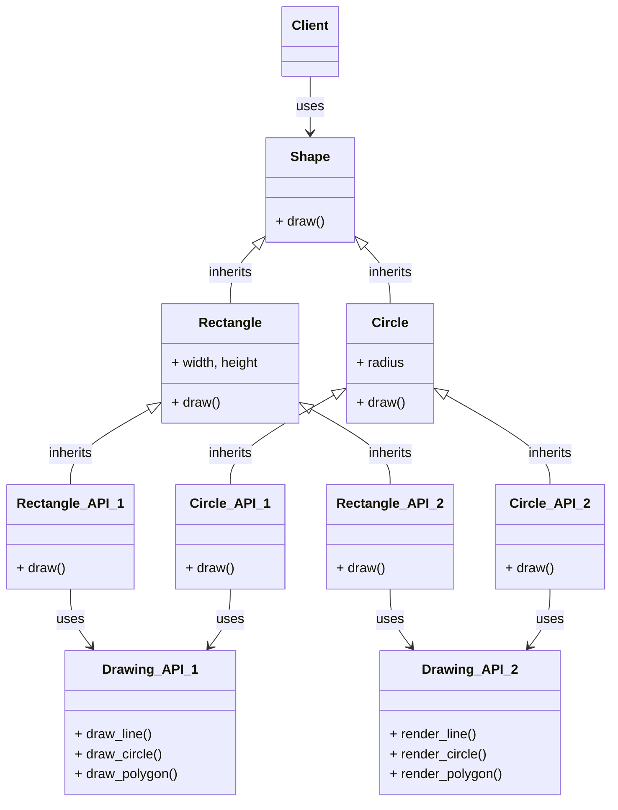

```mermaid


classDiagram
direction TB

    class Client {
    }

    class Shape {        
        + draw()
    }

    class Rectangle {
        + width, height
        + draw()
    }

    class Circle {
      + radius
      + draw()
    }

    class Rectangle_API_1 {
      + draw()
    }

    class Rectangle_API_2 {
      + draw()
    }

    class Circle_API_1 {
      + draw()
    }

    class Circle_API_2 {
      + draw()
    }
    
    class Drawing_API_1 {
       + draw_line()
       + draw_circle()
       + draw_polygon()
    }

    class Drawing_API_2 {
       + render_line()
       + render_circle()
       + render_polygon()
    }

    Client --> Shape : uses
    Shape <|-- Rectangle : inherits
    Shape <|-- Circle : inherits
    Rectangle <|-- Rectangle_API_1 : inherits
    Rectangle <|-- Rectangle_API_2 : inherits
    Circle <|-- Circle_API_1 : inherits
    Circle <|-- Circle_API_2 : inherits

    Rectangle_API_1 --> Drawing_API_1 : uses
    Circle_API_1 --> Drawing_API_1 : uses

    Rectangle_API_2 --> Drawing_API_2 : uses
    Circle_API_2 --> Drawing_API_2 : uses
```