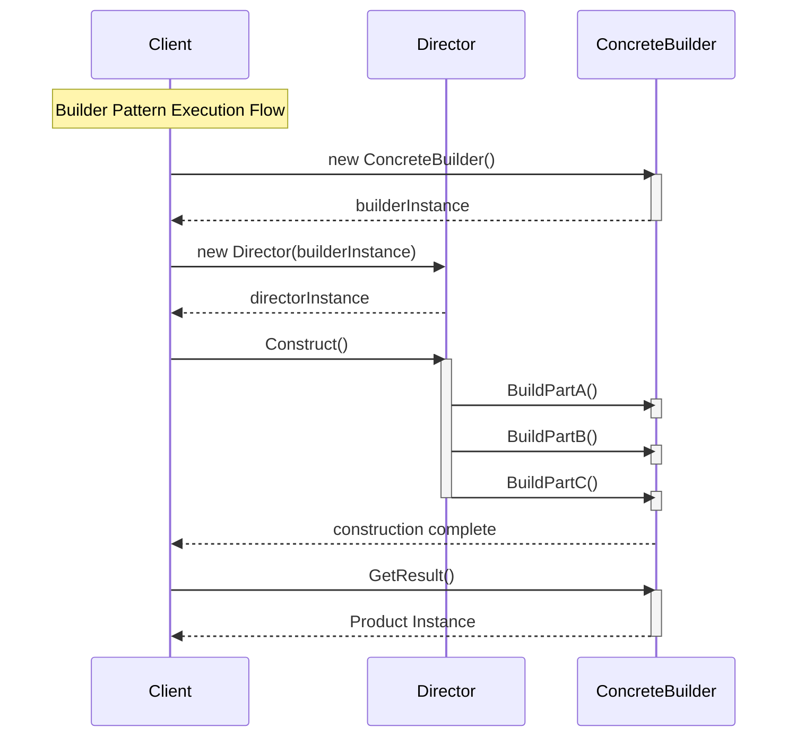

```mermaid
sequenceDiagram
    Note over Client: Builder Pattern Execution Flow
    
    participant Client
    participant Director
    participant ConcreteBuilder


    Client->>ConcreteBuilder: new ConcreteBuilder()
    activate ConcreteBuilder
    ConcreteBuilder-->>Client: builderInstance
    deactivate ConcreteBuilder

    Client->>Director: new Director(builderInstance)
    Director-->>Client: directorInstance
       

    Client->>Director: Construct()
    activate Director
    
    Director->>ConcreteBuilder: BuildPartA()
    activate ConcreteBuilder
    deactivate ConcreteBuilder
    
    Director->>ConcreteBuilder: BuildPartB()
    activate ConcreteBuilder
    deactivate ConcreteBuilder
    
    Director->>ConcreteBuilder: BuildPartC()
    activate ConcreteBuilder
    deactivate ConcreteBuilder
    
    deactivate Director

    ConcreteBuilder-->>Client: construction complete

    Client->>ConcreteBuilder: GetResult()
    activate ConcreteBuilder
    
    ConcreteBuilder-->>Client: Product Instance
    deactivate ConcreteBuilder
```