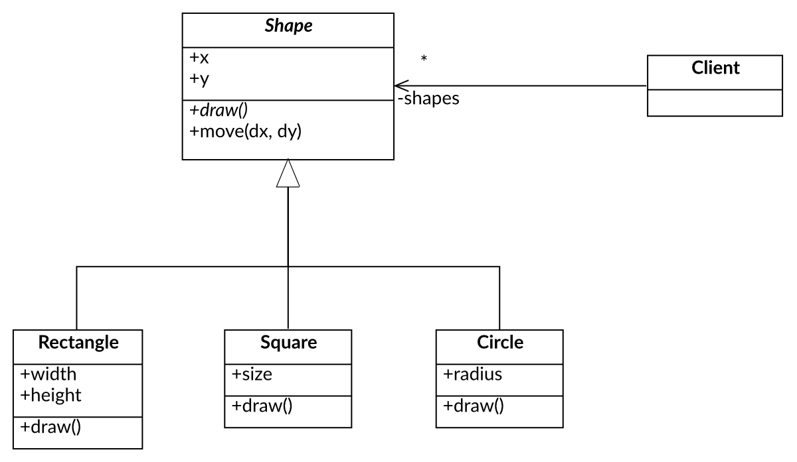
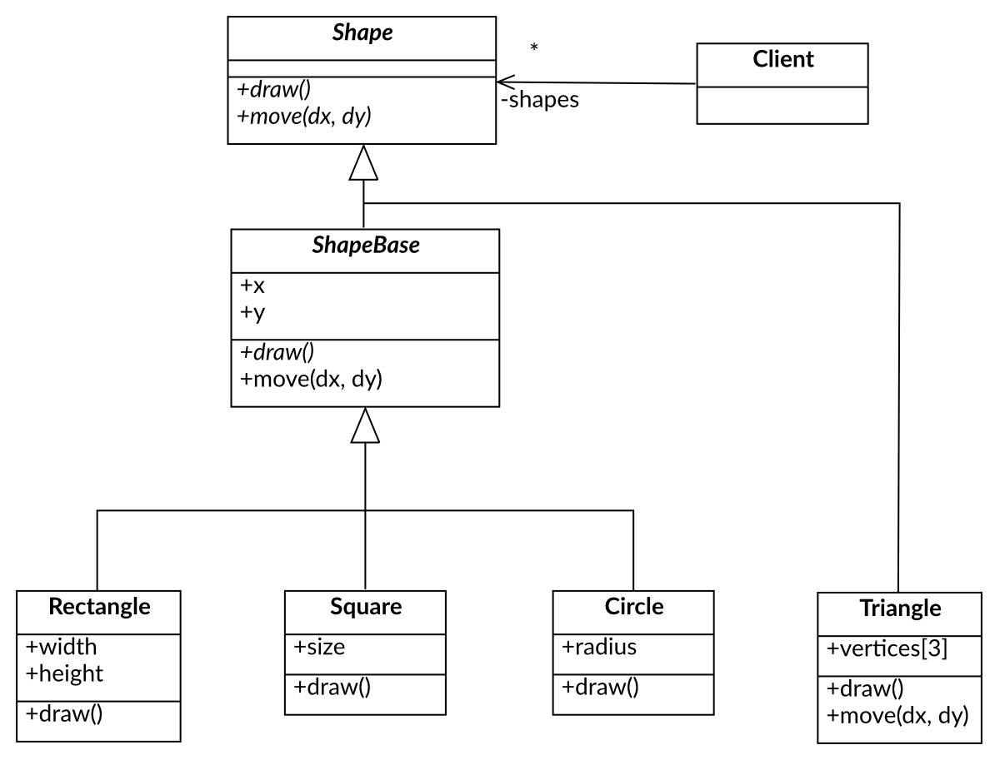

# Foundations of Object-Oriented Programming

## Four tenets of object-oriented programming

Object-oriented programming (OOP) is a programming paradigm that uses "objects" to design applications and computer programs.

It utilizes several techniques to design and develop software. The four major principles of object-oriented programming are:

1. **Abstraction**

    * Abstraction is the concept of hiding the complex implementation details and showing only the necessary features of the object. It helps to reduce programming complexity and effort.

2. **Encapsulation**

    * Encapsulation (aka *Information Hiding*) is the process of bundling the **data** (variables) and the **methods** (functions) that operate on the data into a single unit called a class. All internal details of the class implementation are hidden from the outside world, and only the necessary interface that allows to operate on an object is exposed to the user.

3. **Polymorphism**

    * It allows to perform a single action in different ways. In other words, polymorphism allows to define one interface and have multiple implementations. Objects that have the same interface can be used interchangeably.

4. **Code Reusability: Composition & Inheritance**

    Composition and inheritance are two ways to achieve code reusability in object-oriented programming.

    * **Composition** is a "has-a" relationship between two classes. It allows creating complex types by combining objects of other types.

    * **Inheritance** is an "is-a" relationship between two classes. It allows creating a new class that inherits attributes and methods from an existing class.

## Object - Interface - Class

### Object

An object is a real-world entity that has a state and behavior. It can be a physical entity or a conceptual entity. An object has three main characteristics:

1. **State**: It represents the data (attributes) of an object.

2. **Behavior**: It represents the methods (functions) that operate on the object's state.

3. **Identity**: It gives a unique name to an object and enables one object to interact with another object.

In object oriented software objects communicate with each other using methods. 

### Interface

An interface is a public contract that defines the methods that a class must implement. It specifies what a class must do but not how it does it. Interfaces are used to define the behavior of an object.

Interface is separated from the objects implementation. Many objects that have the same interface can vary in their implementation.

### Class

Class defines the implementation for an object. It is a blueprint for creating objects. It defines the attributes and methods that an object will have.

Class allows to instantiate objects. An object is an instance of a class.

#### Abstract Class

An abstract class is a class that cannot be instantiated. 

It is used to define a common interface for all the subclasses. It allows to define **abstract methods** that must be implemented by the subclasses.

Abstract methods are methods that are declared in the abstract class but do not have an implementation. In C++ they are declared as **pure virtual functions**.

Class that contains at least one pure virtual function is called an abstract class.

Class that implements all the pure virtual functions of an abstract class is called a **concrete class** and can be instantiated.



The code below shows an example of an abstract class `Shape` that defines an interface that contains two virtual functions `move()` and `draw()`. This abstract class has partial implementation. It has members `x` and `y` that represents coordinates. Having these coordinates one can implement the `move()` function. The `draw()` function is a pure virtual function that must be implemented by the derived classes.

``` c++
class Shape 
{
    int x_, y_;
public:
    Shape(int x = 0, int y = 0) : x_{x}, y_{y}
    {}

    virtual ~Shape() = default;

    virtual void move(int dx, int dy) 
    {
        x_ += dx;
        y_ += dy;
    }

    virtual void draw() const = 0;
};

class Rectangle : public Shape 
{
    int width_, height_;
public:
    Rectangle(int x, int y, int width, int height) : Shape(x, y), width_{width}, height_{height}
    {}

    void draw() const override 
    {
        std::cout << "Drawing a rectangle at (" << x_ << ", " << y_ << ") with width " << width_ << " and height " << height_ << std::endl;
    }
};
```


Inheritance from an abstract class with a partial implementation can lead to some issues. For instance, when we want to represent a position of triangle vertices in an array then the derived members `x` and `y` are obsolete. This leads to a waste of memory and can cause a confusion where the state of the object is stored.

#### Extraction of the Pure Interface

In order to avoid dependency on the base class implementation one can extract "the pure interface" - `Shape`. The abstract class `ShapeBase` with a partial implementation derives from the interface. Concrete classes can choose to derive from the interface avoiding unnecessary coupling or from the abstract class avoiding code redundancy.



``` c++
class Shape 
{    
public:                
    virtual ~Shape() = default;

    virtual void move(int dx, int dy)  = 0;
    virtual void draw() const = 0;
};

struct Point { int x, y; };

class ShapeBase : public Shape 
{    
    Point coord_;
public:                
    ShapeBase(int x, int y) : coord_{x, y}
    {}

    void move(int dx, int dy)  override
    {
        coord_.x += dx;
        coord_.y += dy;
    }      
};
```

Now concrete classes can derive from the pure interface:

```c++
class Triangle : public Shape
{
    Point vertices_[3];
public:
    void move(int dx, int dy) override
    {
        for (auto& vertex : vertices_)
        {
            vertex.x += dx;
            vertex.y += dy;
        }
    }

    void draw() const override
    {
        std::cout << "Drawing a triangle [" << vertices_[0] << ", " << vertices_[1] << vertices_[2] << "]" << std::endl;
    }
};
```

or from the abstract class with implementation of coordinates and move.

``` c++
class Rectangle : public ShapeBase 
{    
public:
    Rectangle(int x, int y, int width, int height) : ShapeBase{x, y}
    {        
    }

    void draw() const override 
    {
        std::cout << "Drawing a rectangle at (" << coord_.x << ", " << coord_.y << ") " 
                  << "with width " << width_ << " and height " << height_ << std::endl;
    }
};
```

## Basic OOP Techniques

### Inheritance

Inheritance is a mechanism in which one class acquires the properties and behavior of another class. It allows to define a new class based on an existing class.

One can distinguish between two types of inheritance: 

* **Inheritance of implementation** (*code reuse*) and 
* **Inheritance of interface** (*polymorphism*).

#### Inheritance of Implementation

Inheritance of implementation is a technique that allows to reuse the code of an existing class. It allows to define a new class that inherits the attributes and methods (its implementation) of an existing class.

In C++ inheritance of implementation can be achieved using **private inheritance**.

Example:

```cpp
class Set : private std::set<int> {
    using BaseImpl = std::set<int>;

public:
    using BaseImpl::BaseImpl;

    size_t size() const { return BaseImpl::size(); }

    const int& operator[](size_t index) const 
    {
        return *std::next(BaseImpl::begin(), index);
    }

    bool add_item(int value) 
    {
        return BaseImpl::insert(value).second;
    }

    bool remove_item(int value) 
    {
        return BaseImpl::erase(value) > 0;
    }
};
```

#### Inheritance of Interface

Defines when object of one type (*derived type*) can be used in place of an object of another type (*base type*).

In C++ inheritance of interface can be achieved using **public inheritance from a class that has only abstract methods**.

```c++
class Shape
{
public:
    virtual move(int dx, int dy) = 0
    virtual void draw() const = 0;
    virtual ~Shape() = default;
};

class Square : public Shape
{
    Rectangle rect_;
public:
    Square(int x, int y, int size) : rect_(x, y, size, size) {}
    void move(int dx, int dy) override { rect_.move(dx, dy); }
    void draw() const override { rect_.draw(); }
};
```

When the clients are using a reference or a pointer to the interface class they are unaware of the actual implementation of the object. This allows to change the implementation without affecting the client.

```c++
void draw_shapes(const std::vector<std::unique_ptr<Shape>>& shapes)
{
    for (const auto& shape : shapes)
    {
        shape->draw();
    }
}
```

#### Inheritance - Pros and Cons

**Pros:**

* **Code Reusability**: Inheritance allows to reuse the code of an existing class.
* **Polymorphism**: Inheritance of interfaces allows to define a polymorphic scenario for a group of classes.

**Cons:**

* **Can Breaks Encapsulation**: Inheritance from classes with implementation creates a tight coupling between the base class and the derived class. It is especially problematic when the base class has **protected** data members. It reveals the internal implementation of the base class (breaks encapsulation) to the derived class. Any change in the base class can break the derived classes.

* **Static Behavior**: Inheritance is a static mechanism. The behavior of the derived class is determined at compile time. As a result it is not possible (or at least very difficult) to change the behavior of the derived class at runtime.

```{important}
***Prefer interface inheritance over implementation inheritance!!!***
```

### Composition

Composition is a technique in which one class contains an object of another class. It allows to create complex types by combining objects of other types.

Composition is a "has-a" relationship between two classes.

Example:

```c++
class RecentlyUsedList
{
    std::deque<std::string> list_;
public:
    RecentlyUsedList() = default;

    void add_item(std::string value)
    {
        list_.push_front(std::move(value));
    }

    const int& recent() const
    {
        return list_.front();
    }
};
```

#### Composition - Pros and Cons

**Pros:**

* **Code Reusability**: Composition allows to reuse the code of an existing class.
* **Encapsulation**: Using composition one can only use the public interface of the composed class. It hides the internal implementation of the composed class.
* **Flexibility**: Composition is a dynamic mechanism. References or pointers to the composed objects can be set at run-time. It allows to set or change the behavior of the object at runtime.
* **Cohesion** Composition allows to create classes that have a single responsibility. It is easier to maintain and test such classes.

**Cons:**

* **Complexity**: Composition can lead to a more complex design. It requires to manage the lifetime of the composed objects.
* **Tight Coupling**: When composition uses concrete classes instead of the interfaces it can lead to a tight coupling between the composed objects. It can make the code harder to maintain.

```{important}
**Prefer composition over inheritance!!!**
```

### Delegation

Delegation is a technique in which one object forwards a method call to another object. It allows to reuse the code of an existing class. It is a form of composition, however in static typed languages like C++ it is requires also usage of inheritance.

In delegation there are two objects involved in the process of handling a request:

* **Delegator**: The object that receives the request from a client. Instead of handling the request itself, it forwards the request to the delegate object.
* **Delegate**: The object that implements handling the request. It is the object that actually performs the request. It encapsulates and provides the behavior that is required by the delegator.

The following example compares the delegation and inheritance techniques.

* Code that uses inheritance:

```c++
class TextParagraph
{
    std::string text_;
    Color color_;
public:
    virtual void render(size_t line_width) const
    {
        std::cout << text_ << std::endl;
    }

    // other methods...
};

class RightAlignedTextParagraph : public TextParagraph
{
public:
    void render(int line_width) const override
    {
        std::cout << std::setw(line_width - text_.size()) << text_ << std::endl;
    }
};

class CenteredAlignedTextParagraph : public TextParagraph
{
public:
    void render(size_t line_width) const override
    {
        std::cout << std::setw((line_width - text_.size()) / 2) << text_ << std::endl;
    }
};
```

* Code that uses delegation:

    `TextAlignment` is an interface that defines the behavior of the classes that control the alignment of the text. The instance of `TextParagraph` gets the `render()` request but instead to implement the alignment by itself it delegates the request to the `TextAlignment` object. Alignment can be set and even changed at runtime.

```c++
class TextAlignment
{
public:
    virtual std::string aligned_text(const std::string& text, size_t line_width) const = 0;
    virtual ~Alignment() = default;
};

class LeftAlignment : public TextAlignment
{
public:
    std::string aligned_text(const std::string& text, size_t line_width) const override
    {
        return text;
    }
};

class RightAlignment : public TextAlignment
{
public:
    std::string aligned_text(const std::string& text, size_t line_width) const override
    {
        return std::string(line_width - text.size(), ' ') + text;
    }
};

class CenterAlignment : public TextAlignment
{
public:
    std::string aligned_text(const std::string& text, size_t line_width) const override
    {
        size_t padding = (line_width - text.size()) / 2;
        return std::string(padding) + text + std::string(padding);
    }
};

class TextParagraph
{
    std::string text_;
    Color color_;
    std::unique_ptr<TextAlignment> alignment_;
public:
    void render(size_t line_width) const
    {
        std::cout << alignment_->aligned_text(text_, line_width) << std::endl;
    }

    void set_alignment(std::unique_ptr<Alignment> alignment)
    {
        alignment_ = std::move(alignment);
    }

    // other methods...
};
```

#### Delegation - Pros and Cons

**Pros:**

* **Code Reusability**: Delegation allows to reuse the code of an existing class.
* **Encapsulation**: Using delegation one can only use the public interface of the delegate class. It hides the internal implementation of the delegate class.
* **Loose Coupling**: Delegation allows to create a loose coupling between the delegator and the delegate objects. It allows to change the behavior of the delegator without affecting the delegate object.
* **Flexibility**: Delegation is a dynamic mechanism. References or pointers to the delegate objects can be set at run-time. It allows to set or change the behavior of the object at runtime.
* **Cohesion** Delegation allows to create classes that have a single responsibility. It is easier to maintain and test such classes.

**Cons:**

* **Complexity**: Delegation can lead to a more complex design. It requires to manage the lifetime of the delegate objects.

```{important}
**Delegation is more powerful way of introducing new behavior to the existing classes than inheritance!!!**
```
